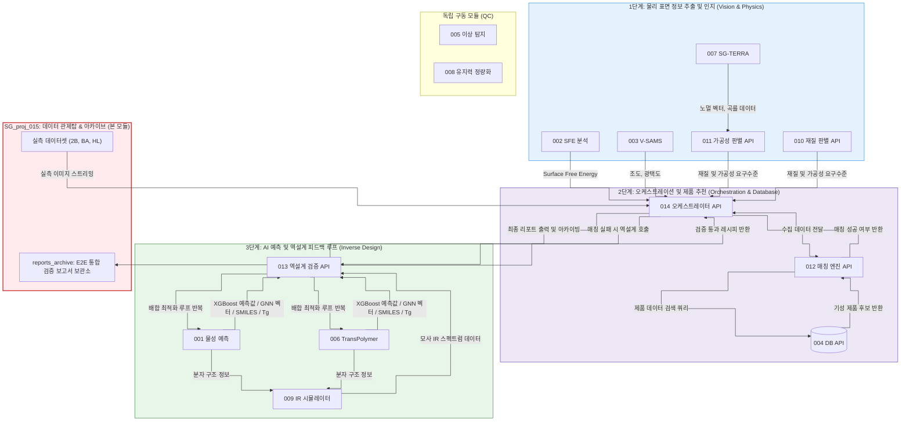

# 통합 표면 분석 플랫폼 데이터 관제탑 및 E2E 아카이브 허브

본 프로젝트는 통합 표면 분석 플랫폼(001~014 마이크로서비스 연동)의 E2E 테스트용 실측 이미지 데이터셋을 중앙 공급하고, 매 테스트 시 생성되는 전체 E2E 통합 검증 보고서 및 계측 시각화 사진들을 체계적으로 축적 및 보존하는 플랫폼의 데이터 관제탑 역할을 수행합니다. 또한 통합 표면 분석 플랫폼의 전체 시스템 데이터 흐름을 체계적으로 정리하여 기술하고, 주요 모듈별 역할 및 데이터 처리 흐름을 상세히 기술합니다.

## 시스템 전체 데이터 제어 및 마이크로서비스 모듈 흐름도 (Mermaid)

사용자가 제공한 시스템 아키텍처 정의에 따라, 각 단계별 모듈의 포함 관계와 모듈 간 전달 데이터, 제어 루프의 흐름을 상세히 묘사한 흐름도입니다.

## 모듈별 상세 역할 및 입출력 데이터 명세

### 1단계: 물리 표면 정보 추출 및 인지 (Vision & Physics)
*   **002 SFE 분석**: 시료 이미지에서 용매 액적 접촉각을 마스킹 및 물리 연산하여 표면 자유 에너지(SFE)를 도출하고 오케스트레이터로 전송합니다.
*   **003 V-SAMS**: 표면 반사광 세기를 계측하여 조도(Ra)와 광택도(GU)를 판별해 전송합니다.
*   **007 SG-TERRA**: 3D 깊이 맵을 복원하고 법선 벡터(Normal Vector) 분포 및 최대 가우시안 곡률 데이터를 산출하여 011 모듈의 입력으로 제공합니다.
*   **011 가공성 판별 API**: 007의 법선 벡터 완충 인자와 재료 강성도를 연산하여, 공정 가혹도(Level 1~5)를 판정하고 오케스트레이터에 회신합니다.
*   **010 재질 판별 API**: 금속 기재의 물리적 고유 특성 정보를 식별하여 매칭 적합성을 판별합니다.

### 2단계: 오케스트레이션 및 제품 추천 (Orchestration & Database)
*   **014 오케스트레이터 API**:
    *   1단계의 모든 비전 분석 결과를 병렬 수집하고 apparent 물리 보정 및 크로스 맵핑 정정을 가합니다.
    *   통합된 분석 메트릭 데이터를 012 매칭 엔진에 전달하여 적합 기성 제품을 추천받습니다.
    *   기성 제품 매칭 실패 시, 즉시 3단계 역설계 루프를 발화하여 신규 수지 처방을 도출합니다.
    *   최종 E2E 검증 리포트 및 이미지를 015 아카이브에 자동 저장하여 기록을 누적합니다.
*   **012 매칭 엔진 API**: 오케스트레이터로부터 수집된 SFE, 조도, 가공 가혹도를 기반으로 TOPSIS 알고리즘을 구동해 최적 제품 우선순위를 정렬합니다.
*   **004 DB API (SQLite)**:
    *   **012 매칭 엔진의 입력**: 제품 정보 조회 쿼리(finish_type, target_surface_energy 등).
    *   **012 매칭 엔진으로의 출력**: 004 DB에 정밀 적재된 사내 기성 제품(SGV201, SGV225 등)의 두께, 점착제 종류, 박리 점착력 스펙 리스트 반환.
    *   **초기 시딩 데이터**: seed.py를 구동하여 2B, BA, HL의 물성 임계값 및 판별 기준 데이터를 사전에 004 DB에 영구 적재합니다.

### 3단계: AI 예측 및 역설계 피드백 루프 (Inverse Design)
*   **013 역설계 검증 API**:
    *   목표 수지 물성(점착력, 점도, Tg)을 충족하기 위한 모노머 배합비 최적화 루프(최대 5회)를 제어합니다.
    *   001, 006, 009 모듈을 연동 호출하여 물리적 적합성과 화학 구조적 적합성을 다각도로 교차 검증합니다.
*   **001 물성 예측**: XGBoost 알고리즘을 사용해 모노머 배합으로부터 물리적 물성(Tg, 점착력, 점도)을 예측하고, 아크릴산(AA) 함량 제약 위반 시 패널티 수치를 반환합니다.
*   **006 TransPolymer**: 딥러닝 기반으로 배합 수지의 자유부피율(FFV) 및 열전도도(Tc) 등의 3차원 분자 동역학적 수치를 도출해 보조 검증 필터로 기여합니다.
*   **009 IR 시뮬레이터**: 배합비 분자 SMILES 데이터를 바탕으로 분자 진동 흡수 스펙트럼 피크 및 GNN 임베딩 벡터를 가상 모사하여 013 모듈에 스펙트럼 피처를 제공합니다.

### 독립 구동 모듈 (QC)
*   **005 이상 탐지**: 강판의 스크래치, 찍힘 등 표면 결함을 독립 탐지합니다.
*   **008 유지력 정량화**: 점착 필름 부착 후의 응집 유지 시간(Shear Holding Time)을 실측하여 최종 품질을 보증합니다.

---

## 디렉토리 구조

*   `reports_archive/`: E2E 연쇄 연산이 완료된 후 산출된 날짜별 통합 E2E 검증 보고서들이 이주 및 적재되어 영구 보존됩니다.
*   `reports_archive/images/`: 보고서 렌더링에 필요한 마스킹 결과 이미지와 깊이 맵 등 모든 실물 캡처 사진 리소스들이 모여 있어 링크 깨짐을 방지합니다.
*   `260408 PCM HL/`, `260521 test_image (droplet)/`: E2E 파이프라인의 실 계측을 위한 2B, BA, HL 강판 원본 실물 이미지 데이터셋이 적재되어 있습니다.

## 최근 주요 변경 사항 (2026-06-29)
- E:\Github\SG_proj_015 독립 리포지토리 분리 완료 및 원격 깃허브 업로드 적용.
- 레거시 템플릿 및 구버전 보고서 5종과 실물 계측 이미지 리소스 전체를 reports_archive/ 및 reports_archive/images/ 하위로 이주 완료.
- 이주된 구버전 리포트들의 마크다운 이미지 상대 경로를 일제히 보정 치환 완료.

## 2026-07-05 업데이트 (014 모듈)
- E2E 테스트 환경 인메모리 격리 및 도메인 기반 Pydantic 스키마 검증 룰 추가 완료.
