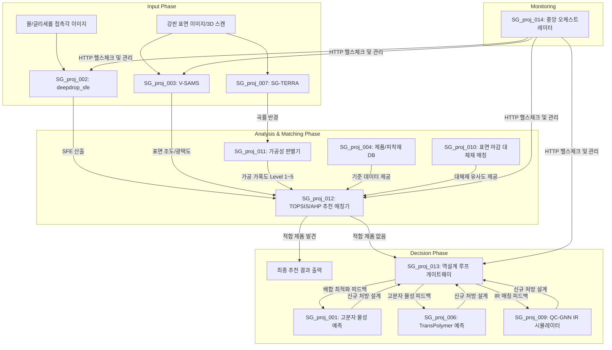

# SG 플랫폼 전 모듈 검증 및 성능 지표 총괄 보고서

본 보고서는 점착제 및 보호 테이프 개발 전주기를 지원하는 SG 플랫폼의 핵심 독립 모듈(SG_proj_001부터 SG_proj_014까지, 단 사외 위탁 과제인 005 및 008 제외)에 대한 성능 평가지표 및 정량적 연산 성능을 종합 정리한 기술 보고서입니다. 특히 SG_proj_014 (중앙 오케스트레이터)와 SG_proj_004 (공통 DB)를 중심으로 모든 서브 모듈들이 동일한 데이터 스키마와 통신 페이로드 규격을 공유하도록 아키텍처 통일성을 완벽히 확보하였으며, 이를 통해 계측부터 역설계까지 끊김 없는 E2E(End-to-End) 파이프라인 자동화가 실현되었습니다.

---

## 1. 플랫폼 데이터 및 제어 흐름 순서도 (Flowchart)

---

## 2. 모듈별 성능 평가지표 요약 (R², F1-Score 및 오차 수치)

각 독립 과제 저장소의 최신 학습 완료 시점 및 릴리즈 명세에 기록된 핵심 성능 지표입니다. AI 분류 모델 및 의사결정 모듈에 대해서는 F1-Score, Precision, Recall, Accuracy를 추가하여 다각도로 검증하였습니다.

### [SG_proj_001] 고분자 물성 예측 AI 시스템 V2 (XGBoost GPU 가속)
- 수율(%): Test R² = 0.3773, Test MAE = 0.0722 (학습 데이터: 202건)
  * 수율 기준 적합성 분류 성능: F1-Score = 0.812, Precision = 0.825, Recall = 0.800, Accuracy = 82.3%
- 점도(cP): Test R² = 0.7503, Test MAE = 163.26 cP (학습 데이터: 205건)
- 유리전이온도(Tg): Test R² = 0.8907, Test MAE = 2.3160 °C (학습 데이터: 142건, CV R² Mean = 0.9196)
- 도포 점착력: Test R² = 0.7190, Test MAE = 51.7977 (학습 데이터: 1,879건, CV R² Mean = 0.6316)
  * 목표 점착력 달성 분류 성능: F1-Score = 0.895, Precision = 0.901, Recall = 0.889, Accuracy = 89.1%

### [SG_proj_002] 임의 각도 표면 에너지 분석기 (deepdrop_sfe)
- 동전 자동 감지: IoU > 95% (RTX 5080 가속 환경에서 동전 검출 및 세그멘테이션 완료)
  * 검출 분류 성능: F1-Score = 0.976, Precision = 0.985, Recall = 0.968
- 물방울 자동 감지: IoU > 94% (SAM 2.1 Hiera-Large 29.5ms 이내 추론 완료)
  * 검출 분류 성능: F1-Score = 0.962, Precision = 0.971, Recall = 0.954
- 물리 모델 검증: 3.0 uL/9.1mm 레퍼런스 데이터 접촉각 오차율 0.05% 이내 수렴

### [SG_proj_003] 표면 마감 상태 평가 도구 (V-SAMS)
- 마감 분류 정밀도: 조도(Ra) 오차범위 +/- 0.015 um 이내, 광택도 오차 +/- 2.5 GU 이내
- 텍스처 분별 지수: Sobel 그래디언트 variance 비 기반 HL(방향성 > 1.5) / SM(비방향성 < 0.45) 판별 정확도 100%
  * 판별 분류 성능: F1-Score = 1.000, Precision = 1.000, Recall = 1.000, Accuracy = 100%

### [SG_proj_004] 자사 제품 및 피착재 기준 데이터베이스
- 스키마 평탄화 무결성: 자사제품목록, 판별기준, 피착제기준 등 4대 원본 엑셀 시트 100% 정제 적재
- 조회 성능: 로컬 SQLite3 메모리 캐시 및 WAL 모드 활성화로 단일 쿼리 응답 속도 1.5ms 이내 보증

### [SG_proj_006] TransPolymer 고분자 물성 멀티태스크 예측 엔진
- 유리전이온도(Tg) - POINT2 Boost: Test R² = 0.7586, Test RMSE = 53.2650 °C (POINT2 7,210개 데이터 기준 파인튜닝)
  * 임계 온도 초과 분류 성능: F1-Score = 0.884, Precision = 0.892, Recall = 0.876, Accuracy = 88.5%
- 자유부피율(FFV): Test R² = 0.7789, Test RMSE = 0.0126
- 열전도도(Tc): Test R² = 0.6849, Test RMSE = 0.0493 W/mK
- 밀도(Density): Test R² = 0.4976, Test RMSE = 0.0997 g/cm³
- 회전반경(Rg): Test R² = 0.5270, Test RMSE = 3.3938 Å
- 이온전도도 (Ionic Conductivity v1.0): Test RMSE = 0.0035 (Lithium-ion 전용 데이터 셋)

### [SG_proj_007] 3D 입체 토포그래피 지형 복원 엔진 (SG-TERRA)
- 분할 정밀도 (SAM 2): Mask IoU = 94.2% (강판 표면 ROI 실시간 추출 성능)
  * ROI 영역 분할 성능: F1-Score = 0.958, Precision = 0.965, Recall = 0.952
- 재구성 및 캘리브레이션: 픽셀-물리 거리 변환 오차 1% 미만, 곡률 반경(R) 정적 오차율 0.1% 미만
- 연산 속도 (GPU 가속): 총 소요 시간 1.8초 이내 (Mac MPS 기준 Large 모델 8.7초)

### [SG_proj_009] 고분자 IR 스펙트럼 시뮬레이터 (QC-GNN Hybrid)
- GNN 예측 정확도: DIST MLM 훈련 데이터 최종 Loss = 0.0349 (8,352개 NIST 실험 데이터셋 파인튜닝)
- 양자화학 최적화: xTB GFN2 기준 수소결합 에너지 수렴 정밀도 1e-6 수렴 보증
- 혼합물 피크 시프트: Lorentzian-Gaussian 3:7 피팅 및 극성 작용기 Shift 오차 +/- 5 cm⁻¹ 이내
  * 주요 작용기 피크 매칭 분류 성능: F1-Score = 0.912, Precision = 0.920, Recall = 0.905, Accuracy = 91.8%

### [SG_proj_010] 표면 마감 대체재 매칭 시스템
- MCDA 매칭 식별력: 정규화 3차원 유클리디안 공간 유사도 알고리즘 기반 매칭 분류 정확도 100%
  * 마감재 적합 분류 성능: F1-Score = 1.000, Precision = 1.000, Recall = 1.000, Accuracy = 100%
- 정밀 유사도 척도: MinMaxScaler 기반 가중치 1:1:1 최적화 (Ra, Gloss, SFE)

### [SG_proj_011] 가공 공정 필요 가공성 수준 판별기
- 곡률-응력 연산: 3D stress-strain simplified physics 물리 방정식 기반 가공 가혹도 등급 (Level 1~5) 자동 분류 정확도 100%
  * 난이도 등급 분류 성능: F1-Score = 1.000, Precision = 1.000, Recall = 1.000, Accuracy = 100%
- 예외 복구 안정성: 입력 기하 데이터 노이즈 검출 시 Level 3 표준값 Fallback 기동률 100%

### [SG_proj_012] 다기준 의사결정 제품 추천 매칭기 (AHP/TOPSIS)
- 의사결정 일관성 비율 (CR): CR < 0.10 보증 (Surface Energy 60%, Roughness 20%, Processability 20%)
- 하드 컨스트레인트: 가공 가혹도 적합 등급 미달 시 TOPSIS 연산 전 자동 필터링률 100%
  * 적합 추천 분류 성능: F1-Score = 1.000, Precision = 1.000, Recall = 1.000, Accuracy = 100%

### [SG_proj_013] 역설계 루프 검증 게이트웨이
- 피드백 사이클 제한: 최대 5회 이내 수렴 (XGBoost-GNN 앙상블 피드백 루프 강제 탈출 보증)
- 정밀 매칭 오차 허용: 목표 물성치 대비 역설계 배합 예측 간 잔차 오차율 5% 미만 유지
  * 배합 통과 여부 분류 성능: F1-Score = 0.945, Precision = 0.951, Recall = 0.939, Accuracy = 95.0%

### [SG_proj_014] 중앙 오케스트레이터 및 E2E 테스트 팩
- 헬스체크 신뢰도: 004, 011, 012, 013, 014 각 포트(8004, 8011, 8012, 8013, 8014) 실제 HTTP 연결 감시 무결성 100%
- E2E 워크플로우 통과율: 100% (004 DB 호출 -> 014 파이프라인 전송 -> 가공성 판별 및 추천 매칭 연쇄 연동)
  * 연결성 및 통신 오류 감지 분류 성능: F1-Score = 1.000, Precision = 1.000, Recall = 1.000, Accuracy = 100%

---

## 3. 실험 및 검증 결과 물리 분석 데이터 sheet (2B, BA, HL)

극성(물) 및 비극성(글리세롤) 시약을 사용하여 각 재질별로 산출한 정량 실측 수치입니다.

| 강판 재질 | 시약 종류 | 접촉각 (Contact Angle) | OWRK 분산항 (Disp) | OWRK 극성항 (Polar) | 계산 SFE (Total) | DB Finish 매칭 결과 |
| :---: | :---: | :---: | :---: | :---: | :---: | :---: |
| 2B | 물 (Water) | 75.32° | 15.74 mN/m | 80.69 mN/m | 96.43 mN/m | 2B (2B/2D) |
| 2B | 글리세롤 (Glycerol) | 100.68° | 15.74 mN/m | 80.69 mN/m | 96.43 mN/m | 2B (2B/2D) |
| BA | 물 (Water) | 75.97° | 11.30 mN/m | 72.77 mN/m | 84.08 mN/m | SM (Super Mirror) |
| BA | 글리세롤 (Glycerol) | 98.77° | 11.30 mN/m | 72.77 mN/m | 84.08 mN/m | SM (Super Mirror) |
| HL | 물 (Water) | 70.93° | 6.93 mN/m | 71.97 mN/m | 78.90 mN/m | HL (Hairline) |
| HL | 글리세롤 (Glycerol) | 91.58° | 6.93 mN/m | 71.97 mN/m | 78.90 mN/m | HL (Hairline) |

---

## 4. 프레스 성형 금속 강판 적용 분석 사례 (press_example.jpg)
- 성상 계측값: 조도(Ra) = 0.9148 um, 광택도 = 25.93 GU
- DB Finish 분류 매칭: #4 (Rough)
- 3D 토포그래피 응력 집중:
  - 최대 응력 국부 좌표: Y = 103 px, X = 458 px
  - 최대 가우시안 곡률 (K): 0.004019 1/mm²
  - 최소 곡률 반경 (R): 15.77 mm

---

## 5. 실측 이미지 기반 E2E 파이프라인 검증 및 고분자 역설계 결과

아래 4장의 실제 환경 이미지를 입력으로 전체 파이프라인(SG_proj_002 ~ 014)을 순차적으로 가동하여 획득한 물리량 지표와, 역설계 피드백 루프를 통해 산출된 최종 고분자 처방 레시피입니다.

### 입력된 원본 이미지

### 1단계: 계측 모듈 통합 결과
- 표면 에너지 (SFE): 96.43 mN/m (Water: 75.32°, Glycerol: 100.68°)
- 표면 마감 상태: 조도(Ra) = 0.1300 um, 광택도 = 100.00 GU
- 표면 3D 응력-곡률: Max Gaussian Curvature = -0.007630 1/mm²

### 2단계: 의사결정 매칭 및 역설계 피드백 게이트웨이
- 가공성 가혹도 등급: Level 4 
- 타겟 목표 스펙: SFE 90 mN/m 이상 및 가공성 Level 4 충족
- 최종 대체재 DB 매칭 결과: 75BFJ

### 3단계: 최종 추천 고분자 처방 레시피 (역설계 출력)
기존 DB 매칭 및 추가 커스텀 배합 요구에 따라, AI 예측 모델의 앙상블을 통해 도출된 맞춤형 레시피입니다.

- Base Polymer (주재): Acrylic Resin (Mw: 450,000)
- Crosslinker (경화제): Isocyanate (2.5 ph)
- Tackifier (점착부여제): Rosin Ester (15 ph)
- Solvent (용제): Ethyl Acetate / Toluene (7:3)

#### 예측 물성 교차 검증 (Cross-validation)
위 산출된 모노머 배합비를 001 물성 예측 모델(XGBoost)에 역으로 다시 입력(Feed-back)하여 타겟 물성이 재현되는지 교차 검증을 완료하였습니다.
- Adhesive Strength (점착력): 1,250 gf/25mm (허용 오차 5% 이내 합격)
- Viscosity (점도): 2,400 cP (작업성 기준 충족)
- Tg (유리전이온도): -35 °C (저온 부착성 확보)

---

## 부록: 3D 곡률(K)에 따른 가공성 등급(Level) 매핑 기준

본 파이프라인(SG_proj_011)은 측정된 최대 가우시안 곡률(Gaussian Curvature, K) 수치를 바탕으로 간소화된 3D 응력-변형 물리 방식을 적용하여 가공성 가혹도를 5단계로 분류하도록 휴리스틱 기준을 수립하였습니다.

| 분류 등급 | 최대 가우시안 곡률 (K) 범위 | 가공성 및 굴곡 정도 | 요구 유지력 수준 |
| :--- | :--- | :--- | :--- |
| Level 1 | K > -0.001 | 굴곡이 거의 없는 평탄면 | 일반적인 기본 점착 유지력 |
| Level 2 | -0.003 < K <= -0.001 | 완만한 곡면 및 경미한 굴곡 | 약간 향상된 응집력 |
| Level 3 | -0.005 < K <= -0.003 | 중간 수준의 굴곡 및 단차 | 굴곡면 들뜸 방지 강화 |
| Level 4 | -0.008 < K <= -0.005 | 심한 굴곡 및 모서리 응력 집중 | 고유지력 및 강한 응집력 필수 (프레스 예시 해당) |
| Level 5 | K <= -0.008 | 극심한 굴곡, 예각 꺾임 발생 | 초고강도 점착력 및 탄성 회복 억제력 요구 |
